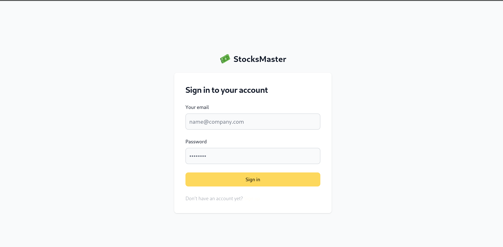

# StocksMaster

StocksMaster is an engaging stock market simulation game designed to make financial literacy accessible to everyone. It provides a realistic yet risk-free environment for users to learn stock trading without the fear of losing money.

# Key Features:
- Real-Time Trading Experience: Users can trade stocks from various industries, reflecting actual market conditions through integrated real-time data feeds.
- Educational Resources: The platform offers tutorials, guides, and in-game tips to educate users on stock trading, helping them understand complex market dynamics.
- Progress Tracking and Analysis: Players can monitor their progress, analyze historical data, and adapt to market changes, gaining practical experience and confidence.
- User-Friendly Interface: Designed with an intuitive interface, StocksMaster ensures accessibility for both beginners and experienced traders.
- Community Engagement: Users can participate in virtual competitions, fostering a community of learners who can share insights and strategies.

## Technologies

- **Backend:** Golang
- **Styling:** Tailwind CSS
- **Performance Optimization:** htmx
- **Page Rendering:** Templ
- **Database:** PostgreSQL

### Run application:
```sh
https://stocksmaster.onrender.com/home
```
Due to free hosting, it takes a while to load.





